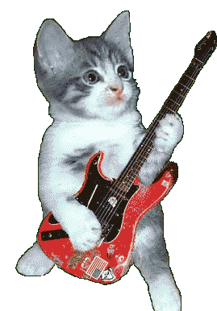
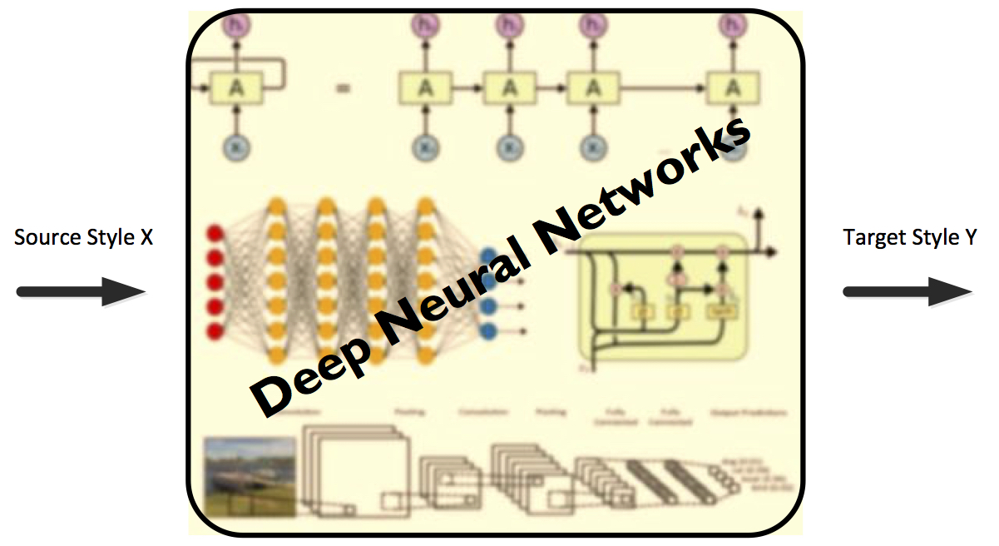
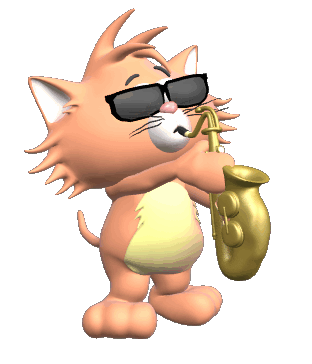
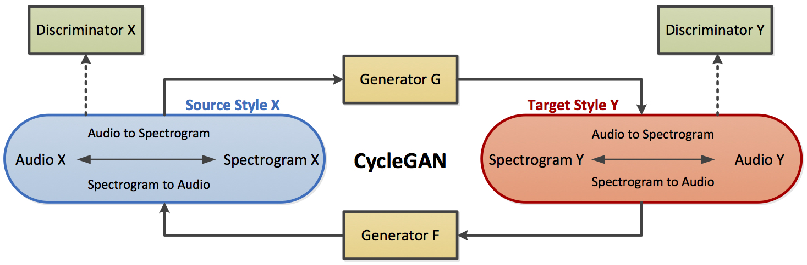
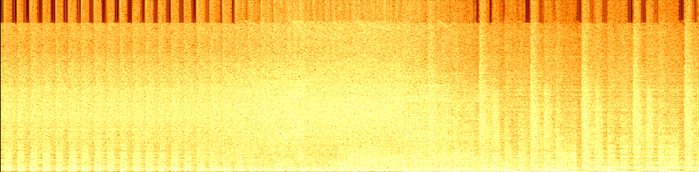
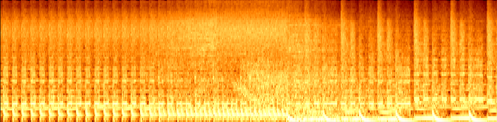
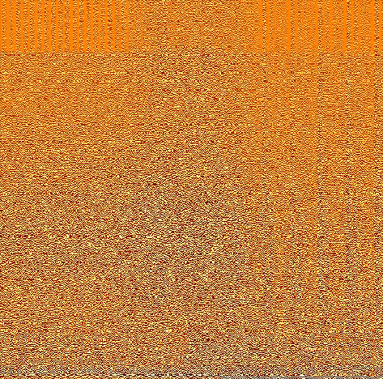
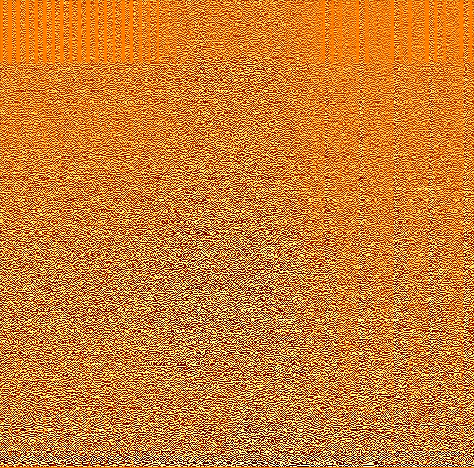
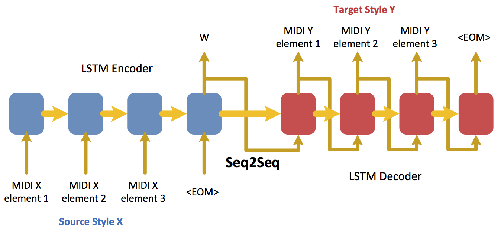

 ## Objective

The recent state of the art Artificial Intelligence (AI) can recognize images and knows how to read and listen. To add onto that, it would be really amazing if machines can not only recognize music, but also create a different genre of music by listening to one particular genre of music. As AI agents become more advanced, the capability of AI being able to produce music would also be pivotal.

The goal of this project is to apply style transfer related deep learning models to transform music from one style to another (e.g. genre to genre). In order to achieve the goal, we have implemented several deep neural network architectures, such as CycleGAN and LSTM, which take the input of audio of one domain and produce the audio of another domain.

  
 

## Previous Studies
Several studies have been conducted in the area of music style transfer and generally music generation using deep learning. Some of them are listed below.

*	[Google Magenta](https://magenta.tensorflow.org/) is a Google Brain project that generates melodies using neural networks. 
*	[Sturm et al.](https://arxiv.org/pdf/1604.08723.pdf) utilized a character-based model with an LSTM to generate a textual representation of a song for music transcription modelling and composition applications.
*	[Johnson](http://www.hexahedria.com/2015/08/03/composing-music-with-recurrent-neural-networks/) developed a biaxial RNN model, consists of time axis and the note axis, to compose music. 
*	[Malik and Ek](https://arxiv.org/pdf/1708.03535.pdf) generated stylized performances of music, that focuses more on different music dynamics, using Bi-directional LSTM architectures.
*	[Yang et al.](https://ismir2017.smcnus.org/wp-content/uploads/2017/10/226_Paper.pdf) proposed MIDINET framework, which uses CNNs to produce melodies that are represented by series of symbolic-domain MIDI notes.  
*	[Dong et al.](https://arxiv.org/pdf/1709.06298.pdf) introduced MuseGAN architecture, which applies GANs idea in symbolic-domain multi-track sequential music generation using a large collection of MIDIs in an unsupervised learning approach.
*	[Ulyanov and Lebedev](https://dmitryulyanov.github.io/audio-texture-synthesis-and-style-transfer/) implemented audio style transfer via artistic style transfer algorithm, which uses convolutions with random weights to represent audio features. 
*	Finally, [Briot et al.](https://arxiv.org/pdf/1709.01620.pdf) published a survey book that discusses various ways of using deep artificial neural networks for musical content generation.

Our main approaches to tackle music style transfer consist of adapting several deep learning techniques that have been introduced in other domains such as image style transfer and machine translation.

## Dataset gathering

Musical data is everywhere, but finding music that is free to use, easily searchable, and easy to categorize by feature can be challenging. The Free Music Archive makes it simpler by offering millions of songs free of difficult copyrights as well as an API that allows music to be filtered by genre/artist/instrument/BPM and many other features. To help facilitate dataset building, we created this github page that shows how to use FMA tools and data subsets to create training datasets:

https://github.com/mjdebord/fma-stft

## Approach I (CycleGAN- Mark's results)

In the first approach ...

 

Image content generation and synthesis have been the subjects of recent advances in generative deep-learning models. Techniques such as CycleGAN have shown great ability to transfer the “style” -- qualities such as colors, textures, and shapes --  of one collection of images to another. A bonus for the CycleGAN technique is that the collections of styles do not need to be explicitly labeled, which makes dataset building much easier. Since CycleGAN is capable of transferring the style of one domain of image content to another, it seems like it could be used to transfer the style between musical domains.

### Data representation
The feature-content of an audio signal such as beat, timbre, and texture are not readily available in a visual way with a raw audio signal. In order to get image-like audio information to use in a CycleGAN, we can compute short-time fourier transforms (STFTs) of a signal which will give us 2d information about the frequencies of that make up a signal over time. An STFT is a complex-valued 2d array, where each value gives us information about the amplitude and phase of the constituent frequencies of the signal. STFTs can be computed in a lossless way such that they are perfectly invertible back to the original signal. 

A common visualization of audio signals are spectrograms which display the amplitudes of constituent frequencies over time. Spectrograms are computed by squaring the STFT matrix and gives us simple 1-channel ‘image-like’ data that can be used in CycleGAN or other image-based techniques. An example (after an additional log transform):

 

Another way to represent spectrogram data is as Mel-frequency-cepstrums, or MFCs. MFCs are popular in speech recognition and musical classification tasks. Per Wikipedia, “[MFCs are] a representation of the short-time power spectrum of a sound, based on a linear cosine transform of a log power spectrum on a nonlinear mel scale of frequency.” Basically, MFCs transform the spectrogram of a signal to a ‘Mel-scale’ in an attempt to portray the power spectrum in a way that better describes how we hear the intensity of different frequencies. This seems like it could be a useful representation for audio style transfer because the most important sound textures will be better represented.

 

One potential problem of using spectrograms or MFCs is that they lose the phase information of a signal. The phase information is important to the timbre of instruments and sounds; two instruments may be able to produce the same ‘C’ note, but they can sound very different due to their timbre. Typically, to invert an amplitude-only spectrogram you need to use an iterative Griffin-Lim algorithm to estimate the correct phase; this can be lossy and sometimes slow. The following examples are the original sound source, and the spectrogram/MFC inversion back to a wave after 42 iterations of a Griffin-Lim algorithm (this takes about a minute in python). 

[Original Sound](https://soundcloud.com/user-94202947/orig-wave?in=user-94202947/sets/samples-for-csci-599)

[Reconstructed from Spectrogram](https://soundcloud.com/user-94202947/recon-wave?in=user-94202947/sets/samples-for-csci-599)

[Reconstructed from MFC](https://soundcloud.com/user-94202947/mel-wave?in=user-94202947/sets/samples-for-csci-599)

Another way we can present STFT information without losing the phase information is to simply separate the real and complex components into separate channels. By doing this, we hope that it will be possible for the CycleGAN to directly learn to modify phase along with amplitude to achieve a style transfer. Some examples (after log-modulus transform):

Real component:

 

Imaginary component:

 

### Vanilla CycleGAN

#### On Spectrograms / MFCs

For our first attempt at using CycleGAN we used an essentially "vanilla" architecture as described in the original CycleGAN paper. The only difference being that the input and output of the generators are now single-channel spectrograms as described above. The first attempt was to try to transfer the stylings of Beethoven and Daftpunk. The network was trained on 25 songs from each artist that were split into 400 5-second spectrograms. After many attempts at slightly modifying hyperparameters this was one of the 'better' results:

[Beethoven](https://soundcloud.com/user-94202947/beet0?in=user-94202947/sets/samples-for-csci-599)

[Beethoven to Daftpunk](https://soundcloud.com/user-94202947/beet2punk?in=user-94202947/sets/samples-for-csci-599)

[Beethoven Reconstructed](https://soundcloud.com/user-94202947/beet2punk2beet?in=user-94202947/sets/samples-for-csci-599)

[Daftpunk](https://soundcloud.com/user-94202947/punk0?in=user-94202947/sets/samples-for-csci-599)

[Daftpunk to Beethoven](https://soundcloud.com/user-94202947/punk2beet?in=user-94202947/sets/samples-for-csci-599)

[Daftpunk Reconstructed](https://soundcloud.com/user-94202947/punk2beet2punk?in=user-94202947/sets/samples-for-csci-599)

The result isn't pleasing, so after many tweeks to the network hyperparameters we also tried to use the MFC representation. The MFC representation produced results that were lower quality than the posted one. Given that MFC data and spectrogram data are visually quite similar, and that MFCs are a lossy format, we anticipated this result. 

We also attempted to use a simplified dataset. The newer dataset was pulled from FMA 'instrumental' and 'electronic' genres and were filtered to only a few songs that have similar BPMs and musical chords for both domains. The intuition behind this is that it might be easier to learn textures and timbre from similarily paced music on the similar musical scales. Unfortunately, the CycleGAN still had trouble producing anything interesting, often times just creating distorted/compressed sounding versions of the original song.

#### On Complex STFTs

In hopes of having CycleGAN produce something better sounding, we also attempted CycleGAN on the 2-channel complex STFT data. The inspiration for this is that the CycleGAN will have more information about each domain available to it, (amplitude *and* phase), so perhaps it may be able to learn a better representation of audio signals. We attempted this with multiple datasets, including this one were we attempted to transfer Daftpunk and 8-bit Nintendo Music (specifically Super Nintendo Mario music). 

[Mario](https://soundcloud.com/user-94202947/mario0?in=user-94202947/sets/samples-for-csci-599)
[Mario to Daftpunk](https://soundcloud.com/user-94202947/mario2daft?in=user-94202947/sets/samples-for-csci-599)
[Mario Reconstructed](https://soundcloud.com/user-94202947/mario2daft2mario?in=user-94202947/sets/samples-for-csci-599)

[Daftpunk](https://soundcloud.com/user-94202947/daft0?in=user-94202947/sets/samples-for-csci-599)
[Daftpunk to Mario](https://soundcloud.com/user-94202947/daft2mario?in=user-94202947/sets/samples-for-csci-599)
[Daftpunk Reconstructed](https://soundcloud.com/user-94202947/daft2mario2daft?in=user-94202947/sets/samples-for-csci-599)

While the results are not amazing, it does appear that the CycleGAN is capable of learning from the 2-channel STFT data even though the relationship between the complex information and the actual audio is more involved. 

#### Problems / Conclusion with Vanilla CycleGAN

It appears that the vanilla CycleGAN has difficulties learning the key features that make up high-quality audio in STFT data. During training, the cycle consistency loss gradually declined and the discriminators quickly learned to distinguish between real and generated samples, but the generator losses were very sporadic and generally did not improve much. 

Some of our results (such as Beethoven to Daftpunk) as well as some [prior work](https://gauthamzz.github.io/2017/09/23/AudioStyleTransfer/) seem to show that this is at least a somewhat valid way to achieve textural style transfer, but after further experiments it seems like the vanilla CycleGAN is fundamentally flawed for this task. The orignal CycleGAN discriminators and generators are based on deep CNNs, which heavily rely on the spatial characteristics of real images such as translational invariance (a shape in the top left corner looks the same if you translate it to the bottom left corner). Although spectrograms can be viewed like regular images, the translational invarient property of the shapes that occur in a spectrogram only works on the temporal axis (a shape in the top left corner does *not* *sound* the same if you translate it to bottom left corner).

Although we didn't have time to try it, it may be possible to get better results with an even more curated dataset. For example, the domains could consist of only particular instruments. This could potentially make the kinds of shapes that appear in the datasets more consistent across the frequency spectrum and hopefully allow the CycleGAN to more easily encode 

### Shallow CycleGAN with tall convolutions 

In an attempt to relax the potential problem with translational varience mentioned in the last section, we also attempted to use a 'shallow' generator design that makes use of many (1024) tall  convolutions (127x1) with only a few layers (2), rather than many small square convolutions in a deep network. The intuition behind this is that when viewing a regular image, you ‘see’ patterns in all RGB channels at once in a given (x,y) window, whereas in audio, you ‘hear’ all of the patterns in all frequency bins at once in a given time window; this makes spectrograms more like 1xT images with F channels rather than FxT single channel images. 

The results from this method sounded worse (on average) than with the preivous CycleGAN methods, potentially indicating that kernel design is not quite as imporant as we had originally thought it might be. (*We only had time to try this on one dataset with one set of parameters, it may still have promise*)

## Approach II - Neural Style on Spectrograms

Another technique we attempted was to try a spectrogram extension of the “Neural Algorithm for Artistic Style” presented in this paper https://arxiv.org/pdf/1508.06576.pdf. We utilized a network similar to the one presented by “Dmitry Ulyanov” who has also extended this work for use on audio https://dmitryulyanov.github.io/audio-texture-synthesis-and-style-transfer/ 

Rather than represent the spectrogram as an FxT single channel image, (number of frequency bins by number of time samples), it is represented as a 1xT image with F channels. The intuition behind doing this is exactly the same as the intuition behind the 'Shallow CycleGAN' method mentioned previously -- the translational invarience of the shapes in the spectrogram only exists on the temporal axis.

In order to represent features with the 1xT spectrogrogram, a shallow convolutional network is used. The network consists of a single convolutional layer working on the temporal axis with 4096 filters that span across all frequency channels. Using this approach with Beethoven source and resulted in these samples:

[Beehoven Source](https://soundcloud.com/user-94202947/beethoven-sonata-no-5-1st?in=user-94202947/sets/samples-for-csci-599-3)
[Mario Source](https://soundcloud.com/user-94202947/mario-10s?in=user-94202947/sets/samples-for-csci-599-3)
[Beethoven w/ Mario Texture](https://soundcloud.com/user-94202947/opus2mario?in=user-94202947/sets/samples-for-csci-599-2)
[Mario w/ Beethoven Texture](https://soundcloud.com/user-94202947/mario2opus?in=user-94202947/sets/samples-for-csci-599-2)

## Approach II (Seq2Seq- Likith's results)

Machine Translation has had a great success by utilizing Seq2Seq models which use LSTM networks to model general purpose encoder-decoder frameworks. For machine translation, Seq2Seq models take text in one language as input and produce an intermediate vector which is further used to produce text in the target language. We applied the same technique to translate between instruments of a midi file, which would achieve the objective of style transfer as music can vary between instruments in the way they are played. The following figure depicts the Seq2Seq framework used in this study.  

 

For this experiment, MIDI data from Clean MIDI subset within Lakh MIDI dataset was used. We considered two instruments that co-occur most frequently in each file in the dataset - Grand Acoustic Piano and String Ensemble. For each file containing both instruments, notes were extracted separately. No timing information was retained. These note numbers varied between 0 and 128. Based on this, the input to the model was a sequence of notes corresponding to Piano and the target was a sequence of notes corresponding to String Ensemble of a particular MIDI file. There were around 300 tracks with the instruments Grand Acoustic Piano (with program number 0) and String Ensemble (with program number 48) in the dataset.

The Seq2Seq model was built with a decoder with Attention mechanism. Luong attention mechanism was used. The hidden size in both encoder and decoder was 30. The embedding size of both encoder and decoder was 30. Attention size was also 30. Each unit in the encoder and decoder RNNs was an LSTM cell. The model was trained for 800 epochs with RMSprop optimizer and a learning rate of 0.001.

Style transfer achieved through this model via machine translation was not very encouraging. The notes produced as a result of translation were repeating and were off form the target sequence. The error through all the iterations did not reduce considerably. As a result, the sounds produced were not indicative of the expected output.

This approach might not have produced good results because the dataset was probably not big enough. After filtering through the dataset to find tracks with two most co-occurring instruments, only 300 tracks were found. Also, in many of these tracks, sequences corresponding to the instruments were not aligned parallely with respect to time i.e., the two instruments did not occur throughout the track and they did not occur concurrently.

A couple of samples produced by the model:

Sample 1:
Input = [samples/Seq2Seq/set_1/input_1.mp3] Prediction = [samples/Seq2Seq/set_1/pred_1.mp3] Target = [samples/Seq2Seq/set_1/target_1.mp3]

Sample 2:
Input = [samples/Seq2Seq/set_2/input_2.mp3] Prediction = [samples/Seq2Seq/set_2/pred_2.mp3] Target = [samples/Seq2Seq/set_2/target_2.mp3]

[These Quotes could probably be put towards the end of the whole report]

“I have not failed. I've just found 10,000 ways that won't work.” - Thomas A. Edison

“We have not failed. We've just found 5 ways that won't work.” - Deep Musicians

## Approach III (CharRNN- Peter's results)

In the third approach ...

